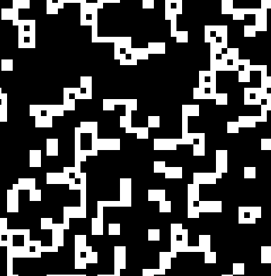

# conway

Rust implementation of Conway's Game of Life

## Overview

This project utilizes the `ggez` crate to
render [Conway's Game of Life](https://en.wikipedia.org/wiki/Conway%27s_Game_of_Life)
on a local computer.

It randomly initializes "Cell" structures in 50x50 2D array, as "alive" or "dead",
and stores them in a "Grid" structure. As the "MainState" structure updates over time, the cells
are updated as follows:

- If a cell has fewer than 2 neighbors, it dies
- If a cell has 2 or 3 neighbors, it lives
- If a cell has more than 3 neighbors, it dies

The graphic itself is rendered with the `ggez` crate, which is a simple 2D game framework.

### Future Work

- Implement a way to pause the game
- Implement a way to provide starting seed
- Implement a way to change the speed of the game
- Implement a way to change the size of the grid
